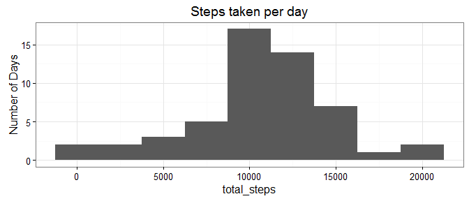
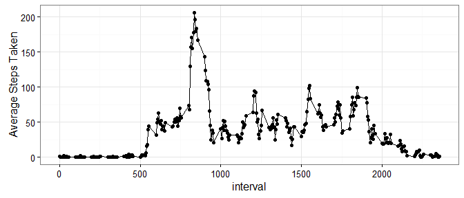
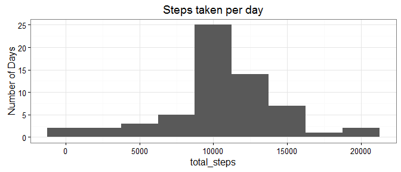
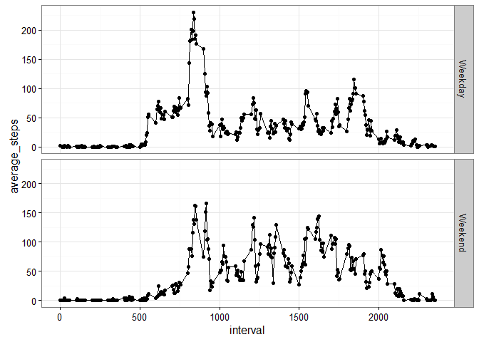

# Reproducible Research: Peer Assessment 1


## Loading and preprocessing the data


```r
# Unzip data file
unzip("activity.zip")
activity_data = read.csv("activity.csv")
```

## What is mean total number of steps taken per day?

```r
# Reform data for sums per day
day_sums = ddply(activity_data,.(date),summarise,
                 total_steps = sum(steps))
day_sums = day_sums[!is.na(day_sums$total_steps),]
```

1. Make a histogram of the total number of steps taken each day

```r
ggplot(day_sums,aes(x=total_steps)) + 
    geom_histogram(binwidth = 2500) +
    ylab("Number of Days") + 
    ggtitle("Steps taken per day") + 
    theme_bw()
```

<!-- -->

2. Calculate and report the mean and median total number of steps taken per day

```r
# Calculate and report the mean and median total number of steps taken per day
mean_steps = mean(day_sums$total_steps,na.rm = T)
median_steps = median(day_sums$total_steps,na.rm = T)
```
The mean number of steps taken per day is **10766**.
The median number of steps taken per day is **10765**.


## What is the average daily activity pattern?

1. Make a time series plot (i.e. type = "l") of the 5-minute interval (x-axis) and the average 
number of steps taken, averaged across all days (y-axis)


```r
# Summarize data for each interval across all days
intervals = ddply(activity_data,.(interval),summarise,
                  ave_steps = mean(steps,na.rm = T))
ggplot(intervals,aes(x=interval,y=ave_steps)) +
            geom_point() + geom_line() + theme_bw() +
            ylab("Average Steps Taken")
```

<!-- -->

2. Which 5-minute interval, on average across all the days in the dataset, contains the maximum number of steps?


```r
max_interval = intervals$interval[intervals$ave_steps == max(intervals$ave_steps)]
```
The maximum number of steps during the day occures during the **835** interval.

## Imputing missing values
Note that there are a number of days/intervals where there are missing values (coded as NA). The presence of missing days may introduce bias into some calculations or summaries of the data.

1. Calculate and report the total number of missing values in the dataset (i.e. the total number of rows with NAs)


```r
num_nas = sum(is.na(activity_data$steps))
```

There are **2304** missing step intervals in the dateset.

2. Devise a strategy for filling in all of the missing values in the dataset. The strategy does not need to be sophisticated. For example, you could use the mean/median for that day, or the mean for that 5-minute interval, etc.

```r
# For intervals missing step data, we will substitue the mean number of steps taken during that interval across all days.
digital_mortar = function(sparse_data){
    require(plyr)
    mean_values = ddply(sparse_data,.(interval),summarise,
                          mean_steps = mean(steps,na.rm = T))
    na_recs = which(is.na(sparse_data$steps))
    sparse_data$steps[na_recs] = mean_values$mean_steps[match(sparse_data$interval[na_recs],mean_values$interval)]
    return(sparse_data)
}
```
3. Create a new dataset that is equal to the original dataset but with the missing data filled in.


```r
filled_data = digital_mortar(activity_data)
```

4. Make a histogram of the total number of steps taken each day and Calculate and report the **mean** and **median** total number of steps taken per day. Do these values differ from the estimates from the first part of the assignment? What is the impact of imputing missing data on the estimates of the total daily number of steps?


```r
#Calculate average steps per day based off of filled_data
day_sums_filled = ddply(filled_data,.(date),summarise,
                 total_steps = sum(steps))

#Make the histogram
ggplot(day_sums_filled,aes(x=total_steps)) + 
    geom_histogram(binwidth = 2500) +
    ylab("Number of Days") + 
    ggtitle("Steps taken per day") + 
    theme_bw()
```

<!-- -->

```r
# Calculate and report the mean and median total number of steps taken per day
mean_steps_filled = mean(day_sums_filled$total_steps,na.rm = T)
median_steps_filled = median(day_sums_filled$total_steps,na.rm = T)
```

On the data where missing values have been filled in a mean number of **10766** and median number of **10766** steps were taken. This compares to a mean of **10766** and median of **10765** for when the missing data was not filled in.

Since there were several full days of missing data, these days contribute to the distribution by stacking up at the mean number of total steps. This drags the calculated median closer to the mean.

## Are there differences in activity patterns between weekdays and weekends?

1. Create a new factor variable in the dataset with two levels -- "weekday" and "weekend" indicating whether a given date is a weekday or weekend day.


```r
filled_data$week_day = "Weekday"
filled_data$week_day[weekdays(as.Date(filled_data$date)) %in% c("Sunday","Saturday")] = "Weekend"
```

2. Make a panel plot containing a time series plot (i.e. type = "l") of the 5-minute interval (x-axis) and the average number of steps taken, averaged across all weekday days or weekend days (y-axis).


```r
#first we need to process the dates to get averages for every interval for the weekend and weekdays
weekday_data = ddply(filled_data,.(interval,week_day),summarise,
                     average_steps = mean(steps,na.rm = T))

# Now plot the step trends with a facet for weekends and one for weekdays
ggplot(weekday_data,aes(x=interval,y=average_steps)) + 
        geom_point() + 
        geom_line() + 
        facet_grid(week_day ~ .) +
        theme_bw()
```

<!-- -->
